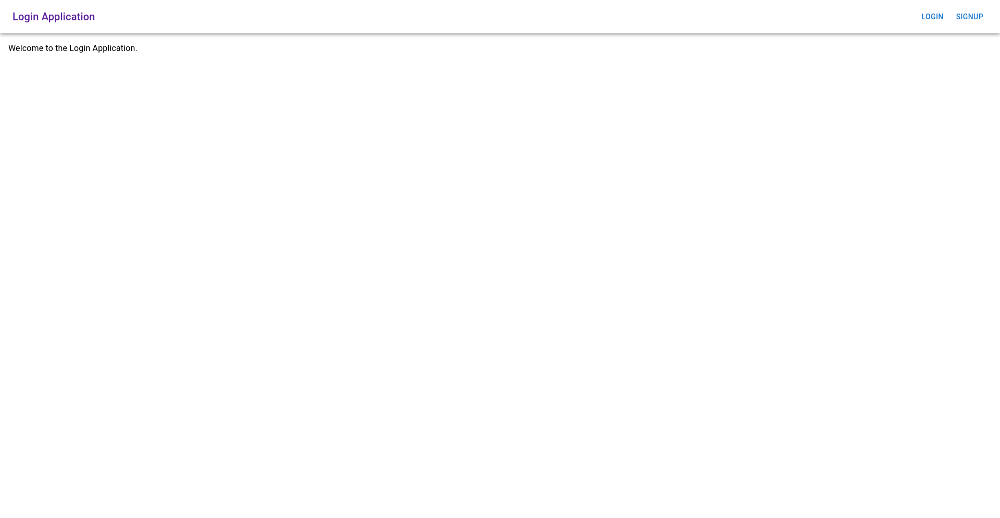
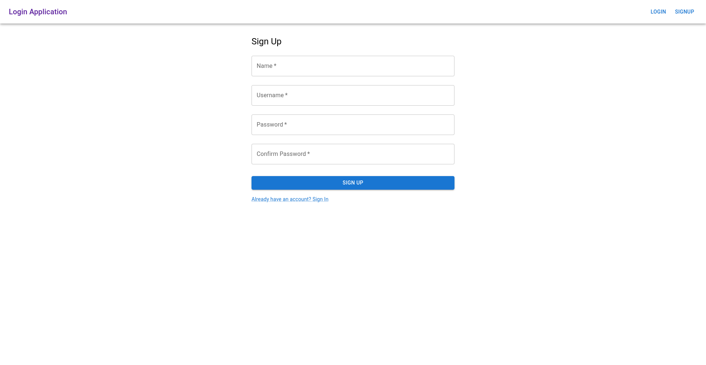
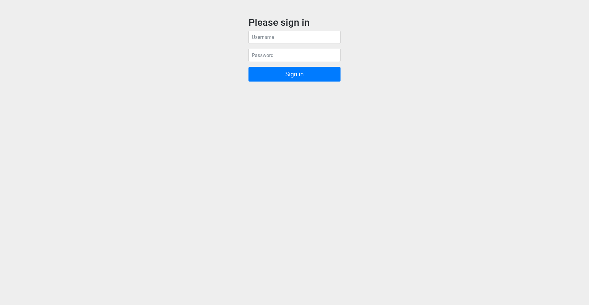
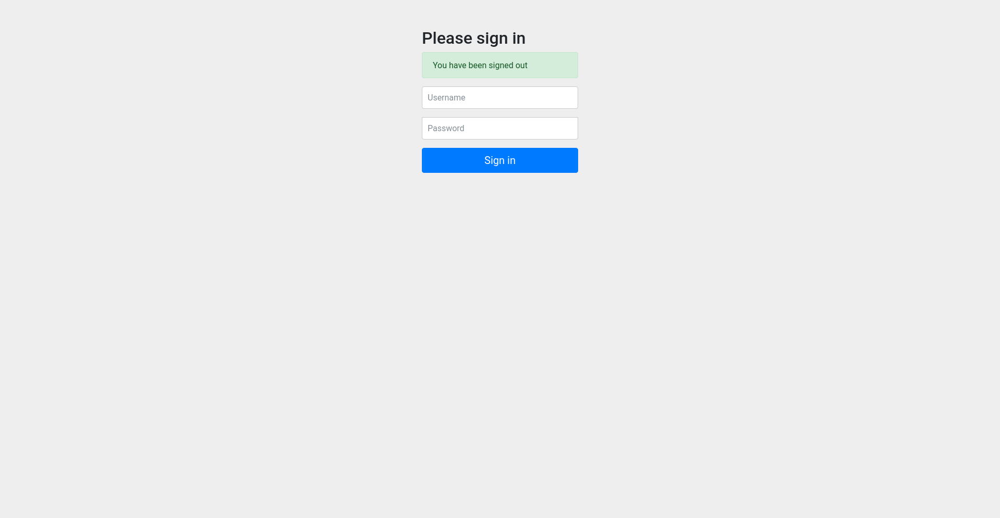
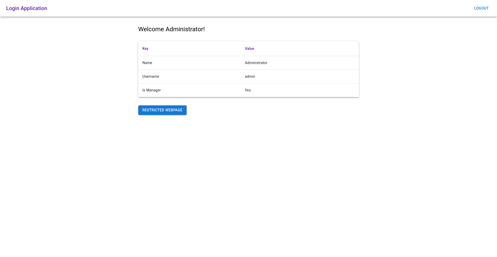
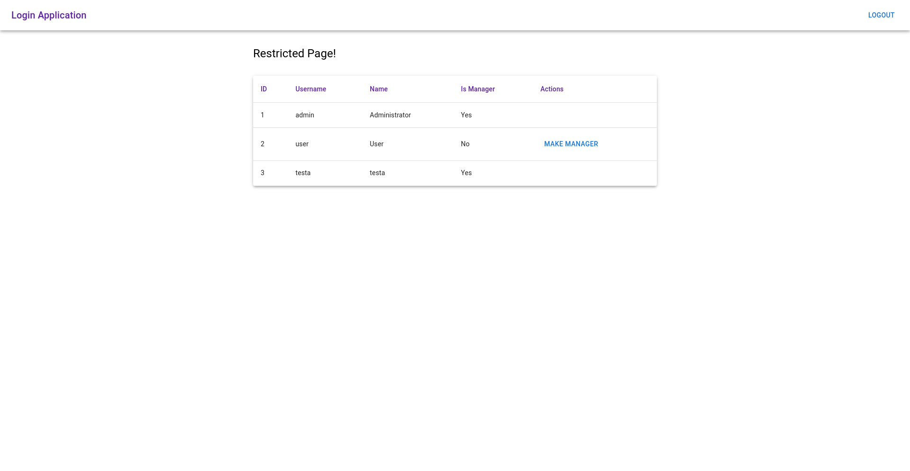

# Login Application

[](https://github.com/alexkmj/login-application/actions/workflows/maven.yml)

Welcome to the Login Application! This is a simple login application that allows
users to login and access a welcome page. Managers can also access a restricted
page and set other users as managers.

This documentation might be a bit verbose, but this is to ensure that the code
is as clear as possible.

# Getting Started

To get started, first ensure you have **Maven** installed. Then run the
following command:

```bash
mvn spring-boot:run
```

This will start the application on port `8080`. You can then navigate to
`http://localhost:8080/` to access the home page. The application will also
create two users, namely `user` and `admin`. Both users have the password
`password`.

If you prefer, you can also set up the application in your preferred IDE and run
it from there.

# Screenshots

Here are some screenshots of the Login Application:

<details>
  <summary>Click to view Screenshots</summary>

## Home Page



## Signup Page



## Login Page



## Logout Page



## Welcome Page



## Restricted Page


</details>

# Pages

The Login Application has the following pages:

- `/` - Home page that can be accessed by anyone
- `/login` - Login page
- `/logout` - Logout page
- `/welcome` - Welcome page that can only be accessed by logged in users
- `/restricted` - Restricted page that can only be accessed by managers
- `/signup` - Signup page that allows users to create a new account

# Stack

The backend is written in *Java* using *Spring Boot*. Specifically,
*Spring Boot Web* and *Spring Boot Security* are used. The frontend is written
in *HTML* and *CSS* with the help of *React.js* and *Material UI*.

# Explaination

The application is a simple login application that allows users to login and
access a welcome page. Managers can also access a restricted page. Managers can
also set other users as managers. The application uses Spring Boot Security to
handle authentication and authorization. The application uses h2 as a database
to store users and their roles. The application uses React.js and Material UI to
create the frontend. The application uses Spring Boot Web to create the REST API
endpoints.

# Pages

- `/` - Home page that can be accessed by anyone
- `/login` - Login page
- `/logout` - Logout page
- `/welcome` - Welcome page that can only be accessed by logged in users
- `/restricted` - Restricted page that can only be accessed by managers
- `/signup` - Signup page that allows users to create a new account

# API

The Login Application has the following API endpoints:

| API                 | Method | Roles          | Description          |
| ------------------- | ------ | -------------- | -------------------- |
| `/api/v1/users`     | `GET`  | `ROLE_USER`    | Get user information |
| `/api/v1/users`     | `POST` | None           | Create a new user    |
| `/api/v1/users`     | `PUT`  | `ROLE_MANAGER` | Update a user        |
| `/api/v1/all-users` | `GET`  | `ROLE_MANAGER` | Get all users        |
